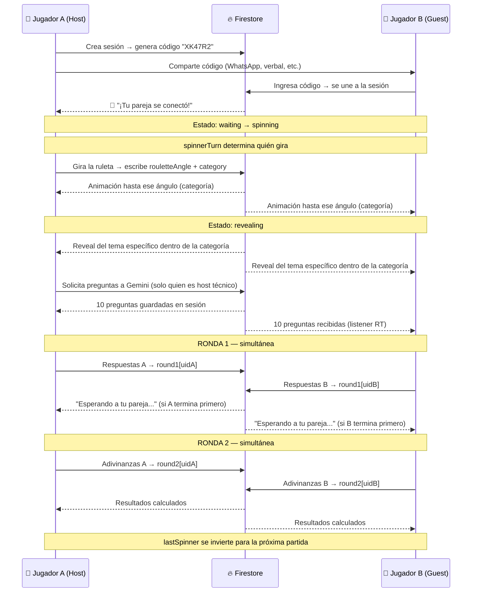
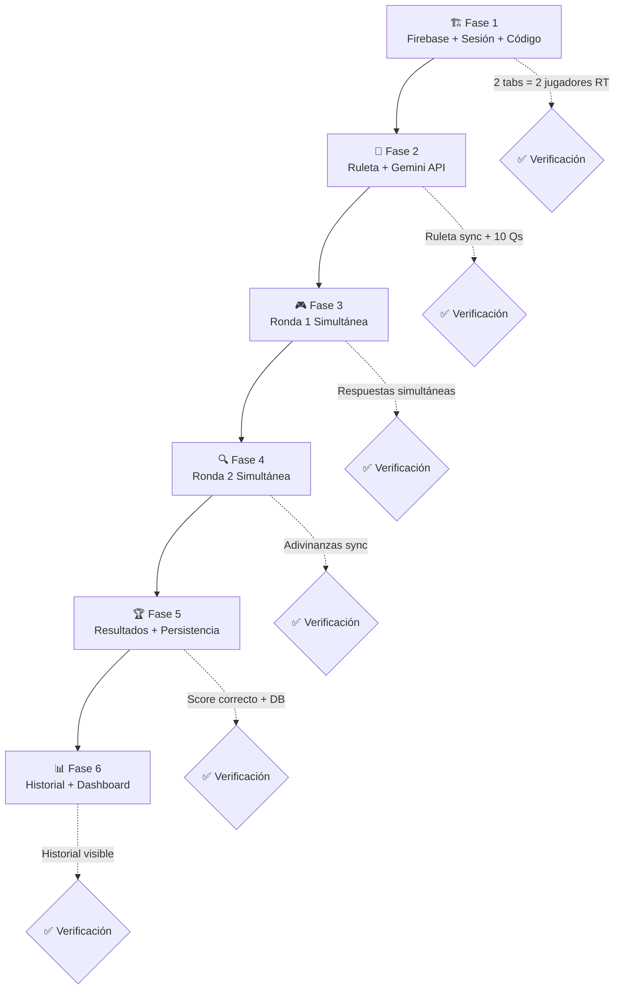

# FunAndCloser — Plan de Ejecución (v3) · Multijugador Real-Time

Aplicación web interactiva para parejas que gamifica la conversación. Cada jugador juega **desde su propio dispositivo** en tiempo real. Un código único sincroniza la sesión. Firebase persiste el historial y el marcador global.

---

## Stack Tecnológico

| Capa | Tecnología | Por qué |
|---|---|---|
| Estructura | HTML5 semántico | Ligero, sin build step |
| Estilos | Tailwind CSS (CDN Play) | Modo oscuro nativo, utilidades rápidas |
| Lógica | JavaScript Vanilla (ES Modules) | Sin dependencias, fácil de mantener |
| IA | Google Gemini API (REST) | Generación dinámica de preguntas |
| Backend / DB | Firebase (Firestore + Auth) | Real-time sync, persistencia, sin servidor |
| Autenticación | Firebase Anonymous Auth | Sin registro obligatorio |

> [!IMPORTANT]
> La arquitectura cambia radicalmente respecto al plan v1. Ya **no se pasa un teléfono**. Cada jugador tiene su propia instancia de la app en su dispositivo. Firebase Firestore actúa como el árbitro en tiempo real entre ambos.

---

## Estructura de Archivos

```
FunAndCloser/
├── index.html                  # Shell SPA · carga todas las vistas
├── styles/
│   └── main.css                # Tokens de diseño, animaciones custom
├── assets/
│   └── icons/                  # SVG icons (ruleta, trofeo, etc.)
└── src/
    ├── main.js                 # Router de vistas, entry point
    ├── state.js                # Estado local del dispositivo
    ├── firebase.js             # Inicialización + config Firebase
    ├── auth.js                 # Anonymous Auth + identidad del jugador
    ├── session.js              # Crear/unirse sesión, código único, listeners RT
    ├── roulette.js             # Ruleta SVG, animación, selección de tema
    ├── geminiService.js        # Llamadas a Gemini API, parsing, validación
    ├── quiz.js                 # Motor de preguntas (Ronda 1 y Ronda 2)
    ├── results.js              # Cálculo Match Score, pantalla de resultados
    └── history.js              # Historial de partidas, marcador global
```

---

## Modelo de Datos en Firestore

```
firestore/
│
├── sessions/{sessionCode}           # Sesión activa (se borra al terminar o expira)
│   ├── code: "ABC123"
│   ├── status: "waiting" | "spinning" | "revealing" | "loading" | "round1" | "round2" | "results"
│   ├── category: "Recuerdos y Conexión"     # categoría ganadora en la ruleta
│   ├── topic: "El Baúl de los Recuerdos"   # tema específico dentro de la categoría
│   ├── rouletteAngle: 1473.5               # ángulo final para sincronizar animación
│   ├── hostId: "uid-del-jugador-A"
│   ├── guestId: "uid-del-jugador-B"
│   ├── spinnerTurn: "host" | "guest"       # quién puede girar esta partida
│   ├── playerNames: { host: "Ana", guest: "Luis" }
│   ├── questions: [ { question, options } x10 ]
│   ├── round1: { [hostId]: [...], [guestId]: [...] }   # respuestas propias
│   ├── round2: { [hostId]: [...], [guestId]: [...] }   # respuestas adivinadas
│   └── scores: { matchA: 0, matchB: 0, total: 0 }
│
└── couples/{coupleId}               # Registro persistente de la pareja
    ├── playerNames: { a: "Ana", b: "Luis" }
    ├── totalGames: 12
    ├── totalMatchAvg: 74.5          # promedio histórico de afinidad
    ├── lastSpinner: "host"          # para alternar el turno en la próxima partida
    ├── wins: { Ana: 5, Luis: 4, empate: 3 }
    └── history: [                   # array de partidas (últimas 50)
        {
          date: timestamp,
          category: "Picantes y Atrevidos",
          topic: "Modo Clandestino",
          matchScore: 80,
          winner: "Ana",
          spinner: "Luis"            # quién giró la ruleta esa partida
        }
      ]
```

---

## Flujo de Sesión (Diagrama)



---

## Fases de Ejecución

---

### 🏗️ Fase 1 — Fundación + Firebase + Sistema de Sesión

**Objetivo**: El esqueleto completo de la app y el sistema de salas multijugador funcionando antes de tocar la ruleta o las preguntas.

#### Alcance
- `firebase.js`: Inicialización con config del proyecto Firebase, exporta `db` (Firestore) y `auth`.
- `auth.js`: Login anónimo al cargar la app. Cada dispositivo recibe un `uid` persistente en `localStorage`. El jugador ingresa su nombre para esa sesión.
- `session.js`:
  - `createSession(playerName)` → genera un código alfanumérico de 6 caracteres, crea el documento en `sessions/{code}`, devuelve el código.
  - `joinSession(code, playerName)` → busca el documento, valida que exista y no esté lleno, se añade como `guestId`.
  - `onSessionUpdate(code, callback)` → listener de Firestore en tiempo real. Cualquier cambio en el documento dispara un re-render.
  - Manejo de reconexión: si el jugador cierra y vuelve, se restaura la sesión desde `localStorage`.
- Pantallas:
  - **Inicio**: nombre del jugador, botón "Crear partida" (genera código) o "Unirse" (input de código).
  - **Sala de espera (Host)**: muestra el código grande, copiable, con botón de copiar al portapapeles. Espera a que llegue el Guest.
  - **Sala de espera (Guest)**: "Conectando con [nombre del host]...".
  - **Sala lista**: ambos ven "¡[NombreA] y [NombreB] están listos! Empezar →" (solo el host puede presionar).
- Vinculación de pareja: al completar la primera partida, se crea o actualiza el documento `couples/{coupleId}` donde `coupleId` se deriva de los dos uids ordenados.

#### Entregable ✅
Dos dispositivos (o dos pestañas del navegador) pueden crear/unirse a una sesión y verse mutuamente en tiempo real.

---

### 🎡 Fase 2 — La Ruleta + Gemini API

**Objetivo**: Ruleta de dos etapas sincronizada entre ambos dispositivos y generación de preguntas via IA.

#### Diseño de Ruleta: Dos Etapas

Con 15 temas reales + Sorpresa, una ruleta de 16 sectores sería ilegible en móvil. La solución es una **ruleta de dos etapas**:

1. **Etapa 1 — Categoría**: La ruleta visible gira y aterriza en una de las 5 categorías.
2. **Etapa 2 — Tema específico**: Una animación de "sobre sellado" se abre revelando qué tema dentro de esa categoría se jugará (elegido aleatoriamente en ese momento).

Esto mantiene la ruleta visualmente limpia y añade un momento de suspense extra en el reveal.

#### Categorías y Temas (5 sectores + 15 temas internos)

| Categoría | Emoji | Color | Temas internos |
|---|---|---|---|
| **Recuerdos y Conexión** | 💭 | `#FFD166` | El Baúl de los Recuerdos · Lector de Mentes · Nuestra Historia · Secretos Revelados |
| **Divertidos y Cotidianos** | 😂 | `#06D6A0` | El Socio Ideal · Intercambio de Cuerpos · Cuestión de Gustos · Terapia de Risas |
| **Para Soñar Juntos** | 🌟 | `#4CC9F0` | La Casa de tus Sueños · Próxima Parada (Viajes) · Metas Compartidas |
| **Picantes y Atrevidos** | 🌶️ | `#FF6B9D` | Modo Clandestino · Fantasías sobre la Mesa · Quién Toma el Control · Noche de Cita 5 Estrellas |
| **🎲 Sorpresa** | 🎲 | gradiente arcoíris | Gemini elige el tema y las preguntas libremente |

#### Descripción detallada de cada tema

<details>
<summary>Ver descripciones (input para los prompts de Gemini)</summary>

**Recuerdos y Conexión**
- **El Baúl de los Recuerdos**: Infancia, peores "osos" en la escuela, qué pensaron físicamente del otro al conocerse.
- **Lector de Mentes**: Manías diarias que solo la pareja conoce, la cara cuando está molesto/a, qué hace primero al despertar, hábitos extraños.
- **Nuestra Historia**: Primeras citas, anécdotas de viajes juntos, el momento donde supieron que la cosa iba en serio.
- **Secretos Revelados**: Travesuras del pasado, mentiras piadosas de niños, cosas que casi nadie más sabe de cada uno.

**Divertidos y Cotidianos**
- **El Socio Ideal**: Si montaran un negocio hoy: quién sería el jefe, quién gastaría en tonterías, de qué sería la empresa.
- **Intercambio de Cuerpos**: 24h en el cuerpo del otro: lo primero que harían, qué les costaría de la rutina del otro, qué ropa se pondrían.
- **Cuestión de Gustos**: Debates sobre comida, música, orden, quién se duerme primero en la peli, quién es el antojado.
- **Terapia de Risas**: Reacciones ante fila larga, llave perdida, estrés cotidiano manejado con humor.

**Para Soñar Juntos**
- **La Casa de tus Sueños**: Cómo la decorarían, qué rincón no puede faltar, quién cocina y quién organiza.
- **Próxima Parada (Viajes)**: Vacaciones perfectas: qué playas, qué aventuras, destino número uno en la lista.
- **Metas Compartidas**: Proyectos y logros que quieren celebrar juntos en los próximos años.

**Picantes y Atrevidos**
- **Modo Clandestino**: Escenarios y lugares atrevidos en el mundo real donde les gustaría tener una aventura arriesgada.
- **Fantasías sobre la Mesa**: Preguntas directas sobre cosas que les gustaría probar en la intimidad cuando se vean en persona.
- **Quién Toma el Control**: Dinámicas de intimidad: quién toma la iniciativa, quién es más tímido, quién es más experimental.
- **Noche de Cita 5 Estrellas**: La noche perfecta al romper la distancia: ambiente, música, ropa, todo lo que no puede faltar.
</details>

#### Turno de la Ruleta — Alternancia

- La **primera partida** siempre la gira el Host (quien creó la sesión).
- Al terminar cada partida, el campo `lastSpinner` en `couples/{coupleId}` se actualiza.
- Al iniciar la siguiente partida, `session.spinnerTurn` se asigna al opuesto de `lastSpinner`.
- En pantalla, quien NO tiene el turno ve el mensaje: *"Es el turno de [pareja] de girar 🎡"* y el botón aparece deshabilitado.
- Esto se sincroniza via Firestore para que ambos dispositivos reflejen la misma UI.

#### Alcance
- `roulette.js`:
  - Ruleta SVG con 5 sectores (categorías), colores vibrantes, texto rotado.
  - Solo el jugador con `spinnerTurn === myRole` puede presionar "Girar".
  - Al girar: se calcula el ángulo final, se escribe en `session.rouletteAngle` + `session.category`.
  - Ambos dispositivos animan la ruleta hasta ese ángulo (listener RT).
  - Al detenerse: `status = "revealing"`. Se muestra la animación de sobre/reveal con el tema específico sorteado dentro de la categoría.
  - Después del reveal: `status = "loading"`.
- `geminiService.js`:
  - Solo el host técnico (quien creó la sesión) llama a `generateQuestions(topic, description, apiKey)`.
  - Prompt adaptado al tema específico y su descripción temática.
  - Las preguntas se escriben en `session.questions` en Firestore.
  - Pantalla de carga sincronizada: spinner temático visible en ambos dispositivos.

#### Entregable ✅
Ambos dispositivos ven: la ruleta girar y detenerse en la categoría → animación de reveal del tema específico → spinner de carga → 10 preguntas listas.

---

### 🎮 Fase 3 — Ronda 1 (Simultánea)

**Objetivo**: Ambos jugadores responden sobre sí mismos al mismo tiempo, cada uno en su propio dispositivo.

#### Alcance
- `quiz.js`:
  - `renderQuestion(index, round)`: renderiza la pregunta con opciones como botones.
  - Al seleccionar una opción → se guarda localmente y se escribe en `session.round1[uid][index]`.
  - Barra de progreso (pregunta X de 10).
  - Avanza automáticamente a la siguiente pregunta tras 0.5s (feedback visual de selección).
- Estado de espera:
  - Al terminar las 10 preguntas, el jugador ve: **"¡Listo! Esperando a [nombre de pareja]... 💬"** con una animación de "typing dots".
  - Firestore listener detecta cuando `round1[uidA]` y `round1[uidB]` tienen ambos 10 respuestas → actualiza `status = "round2"`.
- Instrucción en pantalla: *"Responde estas preguntas sobre ti mismo 🤫 Tu pareja no verá tus respuestas hasta el final."*

#### Entregable ✅
Ambos jugadores responden Ronda 1 de forma independiente y simultánea. La app espera automáticamente al más lento antes de avanzar.

---

### 🔍 Fase 4 — Ronda 2 (El Desafío Match)

**Objetivo**: Ambos jugadores intentan adivinar las respuestas de su pareja en la Ronda 1, simultáneamente.

#### Alcance
- Pantalla de transición sincronizada: *"¡Ronda 2! Ahora intenta adivinar qué respondió [nombre de pareja] 💭"* — se activa cuando `session.status === "round2"`.
- Reutiliza `renderQuestion` con `round: 2`.
  - Las preguntas son idénticas, pero la instrucción cambia: *"¿Qué crees que respondió [pareja]?"*
  - Respuestas guardadas en `session.round2[uid]`.
- Mismo mecanismo de espera al terminar: ambos deben completar para avanzar a resultados.

#### Entregable ✅
Ronda 2 completa y sincronizada. `session` tiene los 4 arrays llenos y `status = "results"`.

---

### 🏆 Fase 5 — Resultados + Persistencia en Firebase

**Objetivo**: Calcular el Match Score, mostrarlo con animaciones, guardar el historial y actualizar estadísticas globales.

#### Cálculo del Match Score

```
matchA = Σ (round2.uidA[i] === round1.uidB[i])   // A adivinó a B
matchB = Σ (round2.uidB[i] === round1.uidA[i])   // B adivinó a A

totalMatch (%) = ((matchA + matchB) / 20) * 100

winner = matchA > matchB ? playerA : matchA < matchB ? playerB : "empate"
```

#### Alcance
- `results.js`:
  - Solo el host calcula y escribe los scores en `session.scores`.
  - Animación del porcentaje: contador que sube en 2s hasta el valor final.
  - Barra circular SVG con `stroke-dashoffset` animado (corazón de afinidad).
  - Desglose: acordeón o lista expandible con las 10 preguntas, mostrando qué respondió cada uno y si fue ✅ acierto o ❌ fallo.
  - Segunda llamada a Gemini: `generateMatchMessage(score, topic, winnerName)` → mensaje personalizado, divertido y temático.
- Persistencia en `couples/{coupleId}`:
  - Incrementa `totalGames`.
  - Actualiza `totalMatchAvg` (promedio móvil).
  - Incrementa `wins[winner]` (o `empate`).
  - Agrega entrada a `history[]` con fecha, tema, score y ganador.
- Botones finales:
  - **"Jugar de Nuevo"**: resetea la sesión (borra `round1`, `round2`, `questions`) y vuelve a la ruleta. Mantiene a los jugadores conectados.
  - **"Ver Historial"**: navega a la Fase 6.

#### Entregable ✅
Pantalla de resultados animada con porcentaje, desglose y mensaje de IA. Datos guardados en Firestore.

---

### 📊 Fase 6 — Dashboard de Historial & Marcador Global

**Objetivo**: Pantalla donde la pareja puede ver su historial completo y estadísticas acumuladas.

#### Alcance
- `history.js`:
  - Accesible desde el inicio con el mismo `coupleId` (derivado de los dos uids).
  - **Estadísticas globales**:
    - Total de partidas jugadas.
    - Promedio de Match Score histórico.
    - Racha actual (últimas N partidas con score > 70%).
    - Quién ha ganado más veces (con gráfico de barras CSS).
  - **Historial de partidas**: lista ordenada por fecha (más reciente primero), con tema, score, ganador y badge de color según el score (🔴 < 50%, 🟡 50-75%, 🟢 > 75%).
  - **Trofeos / Badges**: logros desbloqueables (ej: "Primera partida", "Match perfecto", "10 partidas", "Racha de 5 victorias").

#### Entregable ✅
Dashboard funcional con historial y estadísticas de la pareja.

---

## Diseño Visual (Guía de Estilo)

| Elemento | Especificación |
|---|---|
| Modo | Dark Mode por defecto |
| Fuente principal | `Outfit` (Google Fonts) |
| Fuente display | `Playfair Display` (títulos emocionales) |
| Fondo base | `#0D0D1A` |
| Cards / Superficies | `#1A1A2E` con `backdrop-filter: blur(16px)` |
| Acento primario | `#FF6B9D` (rosa — amor/match) |
| Acento secundario | `#C77DFF` (violeta — misterio/IA) |
| Acento terciario | `#FFD166` (dorado — logros) |
| Éxito | `#06D6A0` (verde esmeralda) |
| Animaciones | `cubic-bezier(0.34, 1.56, 0.64, 1)` — efecto spring |

---

## Roadmap de Fases



---

## Open Questions

> [!IMPORTANT]
> **¿Ya tienes un proyecto Firebase creado?** — Si no, la Fase 1 incluye la creación del proyecto en Firebase Console. ¿Quieres que te guíe paso a paso o ya tienes credenciales listas?

> [!IMPORTANT]
> **¿La API Key de Gemini la ingresa el usuario en runtime o la hardcodeamos?** — Para uso privado entre la pareja, hardcodear es más cómodo. Para distribución pública, mejor que el usuario la ingrese. ¿Cuál es el caso de uso?

> [!IMPORTANT]
> **¿La sección "Picantes y Atrevidos" necesita algún control de acceso o advertencia?** — Propongo un toggle opcional en el perfil de pareja ("Activar modo picante") que oculte esa categoría de la ruleta si no se desea. ¿Lo incluimos?

> [!NOTE]
> **Identificación de pareja para el historial**: El `coupleId` se genera combinando los dos `uid` anónimos de Firebase. Si cualquiera borra datos del navegador, se pierde la asociación. Propongo una **frase de pareja + PIN de 4 dígitos** como identificador alternativo recuperable desde cualquier dispositivo. ¿Lo implementamos así?

> [!NOTE]
> **Sesiones persistentes**: Propongo **30 minutos de inactividad** antes de que una sesión expire en Firestore. ¿Ajustamos este tiempo?
